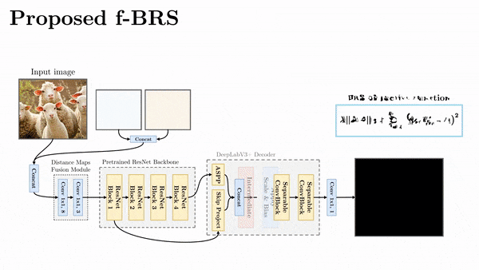
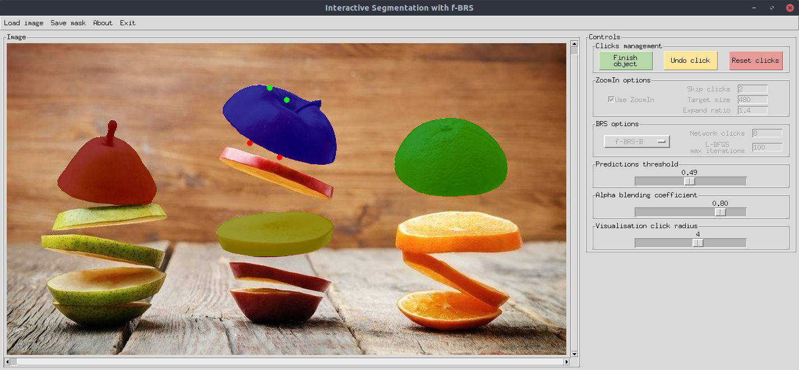
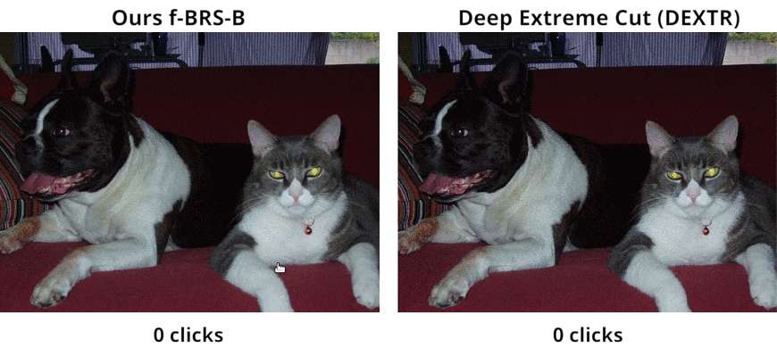

## f-BRS: Rethinking Backpropagating Refinement for Interactive Segmentation [[Paper]](https://arxiv.org/abs/2001.10331) [[PyTorch]](https://github.com/saic-vul/fbrs_interactive_segmentation/tree/master) [[MXNet]](https://github.com/saic-vul/fbrs_interactive_segmentation/tree/mxnet) [[Video]](https://youtu.be/ArcZ5xtyMCk)

This repository provides code for training and testing state-of-the-art models for interactive segmentation with the official PyTorch implementation of the following paper:

> **f-BRS: Rethinking Backpropagating Refinement for Interactive Segmentation**<br>
> [Konstantin Sofiiuk](https://github.com/ksofiyuk), [Ilia Petrov](https://github.com/ptrvilya), [Olga Barinova](https://github.com/OlgaBarinova), [Anton Konushin](https://scholar.google.com/citations?user=ZT_k-wMAAAAJ)<br>
> Samsung AI Center Moscow <br>
> https://arxiv.org/abs/2001.10331

Please see [the video](https://youtu.be/ArcZ5xtyMCk) below explaining how our algorithm works:
<p align="center">
  <a href="https://youtu.be/ArcZ5xtyMCk">
  
  </a>
</p>

We also have full MXNet implementation of our algorithm, you can check [mxnet branch](https://github.com/saic-vul/fbrs_interactive_segmentation/tree/mxnet).

## Setting up an environment

This framework is built using Python 3.6 and relies on the PyTorch 1.4.0+. The following command installs all necessary packages:

```.bash
pip3 install -r requirements.txt
```

You can also use our [Dockerfile](./Dockerfile) to build a container with configured environment.

If you want to run training or testing, you must configure the paths to the datasets in [config.yml](config.yml) (SBD for training and testing, GrabCut, Berkeley, DAVIS and COCO_MVal for testing only).

## Interactive Segmentation Demo

<p align="center">
  
</p>

The GUI is based on TkInter library and it's Python bindings. You can try an interactive demo with any of [provided models](#pretrained-models) (see section [below](#pretrained-models)). Our scripts automatically detect the architecture of the loaded model, just specify the path to the corresponding checkpoint.

Examples of the script usage:

```.bash
# This command runs interactive demo with ResNet-34 model from cfg.INTERACTIVE_MODELS_PATH on GPU with id=0
# --checkpoint can be relative to cfg.INTERACTIVE_MODELS_PATH or absolute path to the checkpoint
python3 demo.py --checkpoint=resnet34_dh128_sbd --gpu=0

# This command runs interactive demo with ResNet-34 model from /home/demo/fBRS/weights/
# If you also do not have a lot of GPU memory, you can reduce --limit-longest-size (default=800)
python3 demo.py --checkpoint=/home/demo/fBRS/weights/resnet34_dh128_sbd --limit-longest-size=400

# You can try the demo in CPU only mode
python3 demo.py --checkpoint=resnet34_dh128_sbd --cpu
```

You can also use the docker image to run the demo. For this you need to activate X-host connection and then run the container with some additional flags:

```.bash
# activate xhost
xhost +

docker run -v "$PWD":/tmp/ \
           -v /tmp/.X11-unix:/tmp/.X11-unix \
           -e DISPLAY=$DISPLAY <id-or-tag-docker-built-image> \
           python3 demo.py --checkpoint resnet34_dh128_sbd --cpu
```

<p align="center">
  
</p>


#### Controls:
* press left and right mouse buttons for positive and negative clicks, respectively;
* scroll wheel to zoom in and out;
* hold right mouse button and drag to move around an image (you can also use arrows and WASD);
* press space to finish the current object;
* when multiple files are open, pressing the left arrow key displays the previous image, and pressing the right arrow key displays the next image;
* use Ctrl+S to save the annotation you're currently editing ("original file name".png).

#### Interactive segmentation options:
* ZoomIn (can be turned on/off using the checkbox)
    * *Skip clicks* - the number of clicks to skip before using ZoomIn.
    * *Target size* - ZoomIn crop is resized so its longer side matches this value (increase for large objects).
    * *Expand ratio* - object bbox is rescaled with this ratio before crop.
* BRS parameters (BRS type can be changed using the dropdown menu)
    * *Network clicks* - the number of first clicks that are included in the network's input. Subsequent clicks are processed only using BRS  (NoBRS ignores this option).
    * *L-BFGS-B max iterations* - the maximum number of function evaluation for each step of optimization in BRS (increase for better accuracy and longer computational time for each click).
* Visualisation parameters
    * *Prediction threshold* slider adjusts the threshold for binarization of probability map for the current object.
    * *Alpha blending coefficient* slider adjusts the intensity of all predicted masks.
    * *Visualisation click radius* slider adjusts the size of red and green dots depicting clicks.

<p align="center">
  
</p>

## Datasets

We train all our models on SBD dataset and evaluate them on GrabCut, Berkeley, DAVIS, SBD and COCO_MVal datasets. We additionally provide the results of models that trained on combination of [COCO](http://cocodataset.org) and [LVIS](https://www.lvisdataset.org) datasets.

Berkeley dataset consists of 100 instances (96 unique images) provided by [[K. McGuinness, 2010]][McGuinness2010].
We use the same 345 images from DAVIS dataset for testing as [[WD Jang, 2019]][BRS], ground-truth mask for each image is a union of all objects' masks.
For testing on SBD dataset we evaluate our algorithm on every instance in the test set separately following the protocol of [[WD Jang, 2019]][BRS].

To construct COCO_MVal dataset we sample 800 object instances from the validation set of [COCO 2017](http://cocodataset.org). Specifically, we sample 10 unique instances from each of the 80 categories. The only exception is the toaster object class, which has only 9 unique instances in instances_val2017 annotation. So to get 800 masks one of the classes contains 11 objects. We provide this dataset for downloading so that everyone can reproduce our results.

[BRS]: http://openaccess.thecvf.com/content_CVPR_2019/papers/Jang_Interactive_Image_Segmentation_via_Backpropagating_Refinement_Scheme_CVPR_2019_paper.pdf
[McGuinness2010]: https://www.sciencedirect.com/science/article/abs/pii/S0031320309000818

| Dataset | Description |      Download Link        |
|---------|-------------|:-------------------------:|
|SBD      |  8498 images with 20172 instances for training and <br> 2857 images with 6671 instances for testing |  [official site][SBD]     |
|Grab Cut |  50 images with one object each   |  [GrabCut.zip (11 MB)][GrabCut]   |
|Berkeley  |  96 images with 100 instances     |  [Berkeley.zip (7 MB)][Berkeley] |
|DAVIS    |  345 images with one object each  |  [DAVIS.zip (43 MB)][DAVIS]       |
|COCO_MVal | 800 images with 800 instances | [COCO_MVal.zip (127 MB)][COCO_MVal] |

[GrabCut]: https://drive.google.com/open?id=1Jh9_6nv7lLNJG5ZZNPAy30HUVpYEoVHT
[Berkeley]: https://drive.google.com/open?id=18zG8WOSlYRLuW94RGir1CCSUAcruw7rw
[DAVIS]: https://drive.google.com/open?id=1DGLWvTFgkCHsWildp-gPSxFrtwwT0BrJ
[SBD]: http://home.bharathh.info/pubs/codes/SBD/download.html
[COCO_MVal]: https://drive.google.com/open?id=1JYyJ7Sef30yLPAJBU5VwomZoE3Pt6fTj

Don't forget to change the paths to the datasets in [config.yml](config.yml) after downloading and unpacking.

## Testing

### Pretrained models
We provide pretrained models with different backbones for interactive segmentation. The evaluation results are different from the ones presented in our paper, because we have retrained all models on the new codebase presented in this repository. We greatly accelerated the inference of the RGB-BRS algorithm - now it works from 2.5 to 4 times faster on SBD dataset compared to the timings given in the paper. Nevertheless, the new results sometimes are even better.

Note that all ResNet models were trained using [MXNet branch](https://github.com/saic-vul/fbrs_interactive_segmentation/tree/mxnet) and then converted to PyTorch (they have equivalent results). We provide the [script](./scripts/convert_weights_mx2pt.py) that was used to convert the models. HRNet models were trained using PyTorch.

You can find model weights and test results in the tables below:

<table>
  <tr>
    <th>Backbone</th>
    <th>Train Dataset</th>
    <th>Link</th>
  </tr>
  <tr>
    <td>ResNet-34</td>
    <td>SBD</td>
    <td><a href="https://drive.google.com/open?id=1rPcGoOa49cG3tzgtGUEHJ5gZWRvGasVy">resnet34_dh128_sbd.pth (Google Drive, 89 MB)</a></td>
  </tr>
  <tr>
    <td>ResNet-50</td>
    <td>SBD</td>
    <td><a href="https://drive.google.com/open?id=1mkv2PqESHHYrR2uG0_LsnA7VGyXcl_HB">resnet50_dh128_sbd.pth (Google Drive, 120 MB)</a></td>
  </tr>
  <tr>
    <td>ResNet-101</td>
    <td>SBD</td>
    <td><a href="https://drive.google.com/open?id=1Z9dQtpWVTobEdmUBntpUU0pJl-pEXUwR">resnet101_dh256_sbd.pth (Google Drive, 223 MB)</a></td>
  </tr>
  <tr>
    <td>HRNetV2-W18+OCR</td>
    <td>SBD</td>
    <td><a href="https://drive.google.com/open?id=18T6eWdTRRWHM5jP6ivqByhZK4XG3SWIc">hrnet18_ocr64_sbd.pth (Google Drive, 39 MB)</a></td>
  </tr>
  <tr>
    <td>HRNetV2-W32+OCR</td>
    <td>SBD</td>
    <td><a href="https://drive.google.com/open?id=1OIs9VW5M8HeADKcRLA6EkOvaRl3lbVVN">hrnet32_ocr128_sbd.pth (Google Drive, 119 MB)</a></td>
  </tr>
  <tr>
    <td>ResNet-50</td>
    <td>COCO+LVIS</td>
    <td><a href="https://drive.google.com/open?id=1aeq127fuL2P2jh-bubiwAw_UzkN5peEa">resnet50_dh128_lvis.pth (Google Drive, 120 MB)</a></td>
  </tr>
  <tr>
    <td>HRNetV2-W32+OCR</td>
    <td>COCO+LVIS</td>
    <td><a href="https://drive.google.com/open?id=1RE-uEw0njTvxzfG4JvHAy7_wTwiG2Rv9">hrnet32_ocr128_lvis.pth (Google Drive, 119 MB)</a></td>
  </tr>
</table>

<table align="center">
  <tr>
    <th rowspan="2">Model</th>
    <th rowspan="2"><span style="font-weight:bold">BRS</span><br><span style="font-weight:bold">Type</span></th>
    <th colspan="2">GrabCut</th>
    <th colspan="2">Berkeley</th>
    <th colspan="2">DAVIS</th>
    <th colspan="2">SBD</th>
    <th colspan="2">COCO_MVal</th>
  </tr>
  <tr>
    <td>NoC<br>85%</td>
    <td>NoC<br>90%</td>
    <td>NoC<br>85%</td>
    <td>NoC<br>90%</td>
    <td>NoC<br>85%</td>
    <td>NoC<br>90%</td>
    <td>NoC<br>85%</td>
    <td>NoC<br>90%</td>
    <td>NoC<br>85%</td>
    <td>NoC<br>90%</td>
  </tr>

  <tr>
    <td rowspan="2">ResNet-34<br>(SBD)</td>
    <td>RGB-BRS</td>
    <td>2.04</td>
    <td>2.50</td>
    <td>2.22</td>
    <td>4.49</td>
    <td>5.34</td>
    <td>7.91</td>
    <td>4.19</td>
    <td>6.83</td>
    <td>4.16</td>
    <td>5.52</td>
  </tr>

  <tr>
    <td>f-BRS-B</td>
    <td>2.06</td>
    <td>2.48</td>
    <td>2.40</td>
    <td>4.17</td>
    <td>5.34</td>
    <td>7.73</td>
    <td>4.47</td>
    <td>7.28</td>
    <td>4.31</td>
    <td>5.79</td>
  </tr>

  <tr>
    <td rowspan="2">ResNet-50<br>(SBD)</td>
    <td>RGB-BRS</td>
    <td>2.16</td>
    <td>2.56</td>
    <td>2.17</td>
    <td>4.27</td>
    <td>5.27</td>
    <td>7.51</td>
    <td>4.00</td>
    <td>6.59</td>
    <td>4.12</td>
    <td>5.61</td>
  </tr>

  <tr>
    <td>f-BRS-B</td>
    <td>2.20</td>
    <td>2.64</td>
    <td>2.17</td>
    <td>4.22</td>
    <td>5.44</td>
    <td>7.81</td>
    <td>4.55</td>
    <td>7.45</td>
    <td>4.31</td>
    <td>6.26</td>
  </tr>

  <tr>
    <td rowspan="2">ResNet-101<br>(SBD)</td>
    <td>RGB-BRS</td>
    <td>2.10</td>
    <td>2.46</td>
    <td>2.34</td>
    <td>3.91</td>
    <td>5.19</td>
    <td><b>7.23</b></td>
    <td>3.78</td>
    <td><b>6.28</b></td>
    <td>3.98</td>
    <td>5.45</td>
  </tr>

  <tr>
    <td>f-BRS-B</td>
    <td>2.30</td>
    <td>2.68</td>
    <td>2.61</td>
    <td>4.22</td>
    <td>5.32</td>
    <td><b>7.35</b></td>
    <td>4.20</td>
    <td>7.10</td>
    <td>4.11</td>
    <td>5.91</td>
  </tr>

  <tr>
    <td rowspan="2">HRNet-W18+OCR<br>(SBD)</td>
    <td>RGB-BRS</td>
    <td>1.68</td>
    <td><b>1.94</b></td>
    <td>1.99</td>
    <td>3.81</td>
    <td>5.49</td>
    <td>7.98</td>
    <td>4.19</td>
    <td>6.84</td>
    <td>3.62</td>
    <td><b>5.04</b></td>
  </tr>

  <tr>
    <td>f-BRS-B</td>
    <td>1.86</td>
    <td>2.18</td>
    <td>2.07</td>
    <td>3.96</td>
    <td>5.62</td>
    <td>8.08</td>
    <td>4.70</td>
    <td>7.65</td>
    <td>3.87</td>
    <td>5.57</td>
  </tr>

  <tr>
    <td rowspan="2">HRNet-W32+OCR<br>(SBD)</td>
    <td>RGB-BRS</td>
    <td>1.80</td>
    <td>2.16</td>
    <td>2.00</td>
    <td><b>3.58</b></td>
    <td>5.40</td>
    <td>7.59</td>
    <td>3.87</td>
    <td><b>6.33</b></td>
    <td>3.61</td>
    <td><b>5.12</b></td>
  </tr>

  <tr>
    <td>f-BRS-B</td>
    <td>1.78</td>
    <td>2.16</td>
    <td>2.13</td>
    <td><b>3.69</b></td>
    <td>5.54</td>
    <td>7.62</td>
    <td>4.31</td>
    <td>7.08</td>
    <td>3.82</td>
    <td>5.44</td>
  </tr>

  <tr>
    <td class="divider" colspan="12"><hr /></td>
  </tr>

  <tr>
    <td rowspan="2">ResNet-50<br>(COCO+LVIS)</td>
    <td>RGB-BRS</td>
    <td>1.54</td>
    <td>1.76</td>
    <td>1.56</td>
    <td>2.70</td>
    <td>4.93</td>
    <td><b>6.22</b></td>
    <td>4.04</td>
    <td><b>6.85</b></td>
    <td>2.41</td>
    <td><b>3.47</b></td>
  </tr>

  <tr>
    <td>f-BRS-B</td>
    <td>1.52</td>
    <td>1.74</td>
    <td>1.56</td>
    <td>2.61</td>
    <td>4.94</td>
    <td><b>6.36</b></td>
    <td>4.29</td>
    <td><b>7.20</b></td>
    <td>2.34</td>
    <td><b>3.43</b></td>
  </tr>

  <tr>
    <td rowspan="2">HRNet-W32+OCR<br>(COCO+LVIS)</td>
    <td>RGB-BRS</td>
    <td>1.54</td>
    <td><b>1.60</b></td>
    <td>1.63</td>
    <td><b>2.59</b></td>
    <td>5.06</td>
    <td>6.34</td>
    <td>4.18</td>
    <td>6.96</td>
    <td>2.38</td>
    <td>3.55</td>
  </tr>

  <tr>
    <td>f-BRS-B</td>
    <td>1.54</td>
    <td><b>1.69</b></td>
    <td>1.64</td>
    <td><b>2.44</b></td>
    <td>5.17</td>
    <td>6.50</td>
    <td>4.37</td>
    <td>7.26</td>
    <td>2.35</td>
    <td>3.44</td>
  </tr>

</table>


### Evaluation

We provide the script to test all the presented models in all possible configurations on GrabCut, Berkeley, DAVIS, COCO_MVal and SBD datasets. To test a model, you should download its weights and put it in `./weights` folder (you can change this path in the [config.yml](config.yml), see `INTERACTIVE_MODELS_PATH` variable). To test any of our models, just specify the path to the corresponding checkpoint. Our scripts automatically detect the architecture of the loaded model.

The following command runs the model evaluation (other options are displayed using '-h'):

```.bash
python3 scripts/evaluate_model.py <brs-mode> --checkpoint=<checkpoint-name>
```

Examples of the script usage:
```.bash
# This command evaluates ResNet-34 model in f-BRS-B mode on all Datasets.
python3 scripts/evaluate_model.py f-BRS-B --checkpoint=resnet34_dh128_sbd

# This command evaluates HRNetV2-W32+OCR model in f-BRS-B mode on all Datasets.
python3 scripts/evaluate_model.py f-BRS-B --checkpoint=hrnet32_ocr128_sbd

# This command evaluates ResNet-50 model in RGB-BRS mode on GrabCut and Berkeley datasets.
python3 scripts/evaluate_model.py RGB-BRS --checkpoint=resnet50_dh128_sbd --datasets=GrabCut,Berkeley

# This command evaluates ResNet-101 model in DistMap-BRS mode on DAVIS dataset.
python3 scripts/evaluate_model.py DistMap-BRS --checkpoint=resnet101_dh256_sbd --datasets=DAVIS
```

### Jupyter notebook

You can also interactively experiment with our models using [test_any_model.ipynb](./notebooks/test_any_model.ipynb) Jupyter notebook.

## Training

We provide the scripts for training our models on SBD dataset. You can start training with the following commands:
```.bash
# ResNet-34 model
python3 train.py models/sbd/r34_dh128.py --gpus=0,1 --workers=4 --exp-name=first-try

# ResNet-50 model
python3 train.py models/sbd/r50_dh128.py --gpus=0,1 --workers=4 --exp-name=first-try

# ResNet-101 model
python3 train.py models/sbd/r101_dh256.py --gpus=0,1,2,3 --workers=6 --exp-name=first-try

# HRNetV2-W32+OCR model
python3 train.py models/sbd/hrnet32_ocr128.py --gpus=0,1 --workers=4 --exp-name=first-try
```

For each experiment, a separate folder is created in the `./experiments` with Tensorboard logs, text logs, visualization and model's checkpoints. You can specify another path in the [config.yml](config.yml) (see `EXPS_PATH` variable).

Please note that we have trained ResNet-34 and ResNet-50 models on 2 GPUs, ResNet-101 on 4 GPUs (we used Nvidia Tesla P40 for training). If you are going to train models in different GPUs configuration, you will need to set a different batch size. You can specify batch size using the command line argument `--batch-size` or change the default value in model script.

We used pre-trained HRNetV2 models from [the official repository](https://github.com/HRNet/HRNet-Image-Classification). If you want to train interactive segmentation with these models, you need to download weights and specify the paths to them in [config.yml](config.yml).

## License

The code is released under the MPL 2.0 License. MPL is a copyleft license that is easy to comply with. You must make the source code for any of your changes available under MPL, but you can combine the MPL software with proprietary code, as long as you keep the MPL code in separate files.


## Citation

If you find this work is useful for your research, please cite our paper:
```
@article{fbrs2020,
  title={f-BRS: Rethinking Backpropagating Refinement for Interactive Segmentation},
  author={Konstantin Sofiiuk, Ilia Petrov, Olga Barinova, Anton Konushin},
  journal={arXiv preprint arXiv:2001.10331},
  year={2020}
}
```
